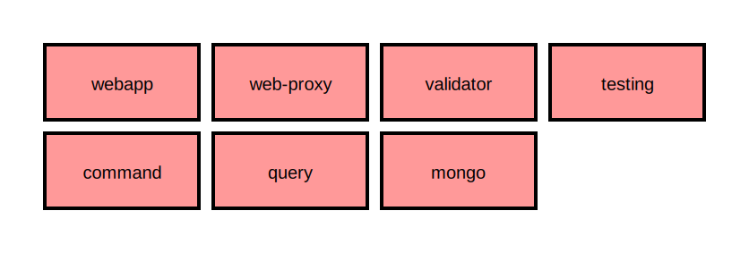
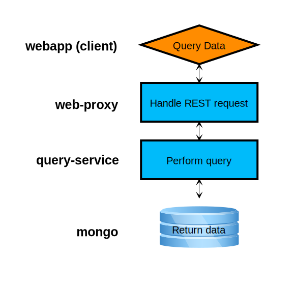
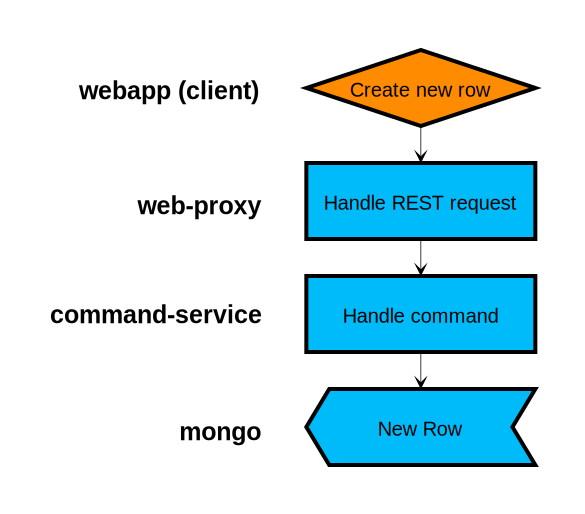
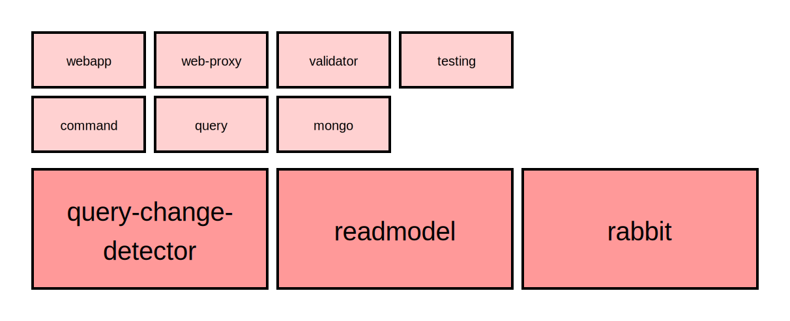
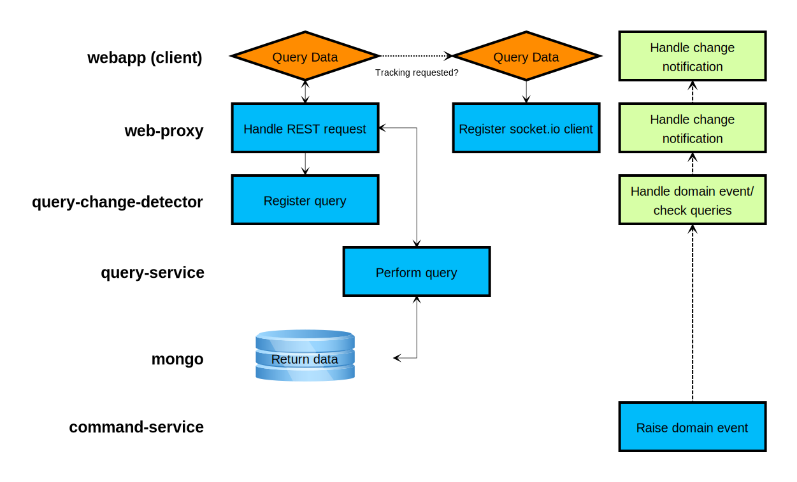
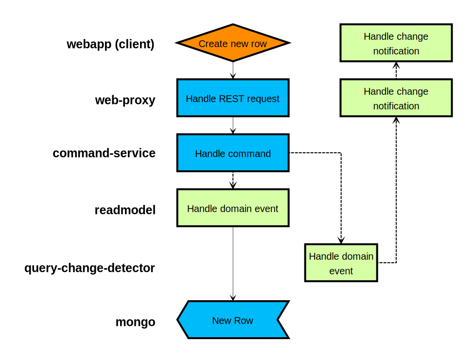

## Microservices

A Complete Picture

> Oliver Sturm &bull; @olivers &bull; oliver@oliversturm.com

&nbsp;&nbsp;

---

## Oliver Sturm

* Training Director at DevExpress
* Consultant, trainer, author, software architect and developer for over 25 years
* Microsoft C# MVP

* Contact: oliver@oliversturm.com

---

## Agenda

* Service structure 
  * A look at a microservices architecture
* Communication
  * Considerations pro and con frameworks
  * Working with individual services
* Packaging/deployment
  * Developer concerns
  * Real-world deployment with AWS
* Developer stuff
  * Debugging

---

## Service structure

My demo application system has at least seven services:

^

## Querying data

^

## Creating a new row

^

## Service structure

More advanced architecture has more services:

^

## Querying data with CQRS/ES

^

## Creating a new row with CQRS/ES

---

## Sources

* This presentation: 
  * https://oliversturm.github.io/microservices-complete-picture
  * Deprettified content in pdf format: https://oliversturm.github.io/microservices-complete-picture/slidecontent.pdf

---

## Thank You

Please feel free to contact me about the content anytime.

oliver@oliversturm.com
