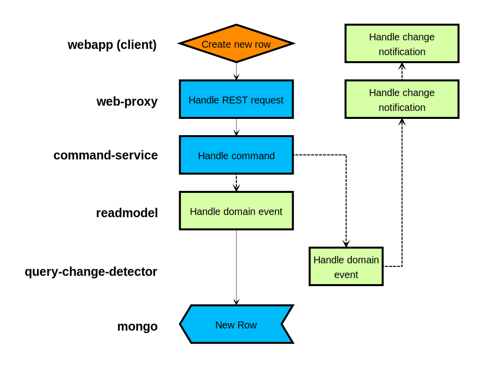

title: Microservices
subtitle: A Complete Picture
class: animation-fade
layout: true

<!-- This slide will serve as the base layout for all your slides -->

.bottom-bar[
{{title}}
]

---

class: impact

# {{title}}

## {{subtitle}}

.title-oli[
Oliver Sturm &bull; @olivers &bull; oliver@oliversturm.com
]

.title-logo[

]

---

## Oliver Sturm

* Training Director at DevExpress
* Consultant, trainer, author, software architect and developer for over 25 years
* Microsoft C# MVP

* Contact: oliver@oliversturm.com

---

## Agenda

* Service structure
  * A look at a microservices architecture
* Communication
  * Considerations pro and con frameworks
  * Working with individual services
* Packaging/deployment
  * Developer concerns
  * Real-world deployment with AWS
* Developer stuff
  * Debugging

---

## Seven Services of the Demo Application

.svg-light-width[

]

---

## Querying Data

.svg-light[

]

---

## Creating a New Row

.svg-light[

]

---

## Additional Services for Advanced Architecture

.svg-light-width[

]

---

## Querying Data with CQRS/ES

.svg-light[

]

---

## Creating a New Row with CQRS/ES

.svg-light[

]

---

## Communication

* Structural question: _who talks to who_?
* Implementation question: _how does the talking work_?

---

## Direct Communication

.svg-light[

]

---

## Using a Broker

.svg-light[

]

---

## How does the talking work?

* Each service could be an _open web service_ with its own external interface. REST? Proprietary? Your choice.
* Each service could be implemented to _talk to the broker exclusively_
* _Libraries_ exist that implement communication

---

## Packaging/deployment

* Running lots of services manually isn't much fun
  * Consider _automation_
* Services may need _individual runtime environments_
* _Container systems_ to the rescue!

---

## Debugging

* _Granularity_ of services makes it easy to test
* Services can be debugged as _individual autonomous entities_
  * Best regards from functional programming!

---

## Sources

* This presentation:

  * https://oliversturm.github.io/microservices-complete-picture
  * PDF download:  https://oliversturm.github.io/microservices-complete-picture/slides.pdf

* Demo code:

  * https://github.com/oliversturm/cqrs-grid-demo (check _master_ and _event-sourcing_ branches)

---

class: impact

# Thank You

Please feel free to contact me about the content anytime.

.title-oli[
Oliver Sturm &bull; @olivers &bull; oliver@oliversturm.com
]

.title-logo[

]
